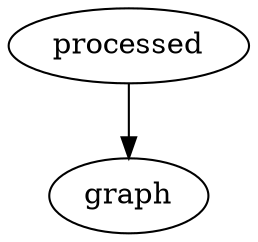

# mdBook Graphviz

[](https://crates.io/crates/mdbook-graphviz)
[](LICENSE)

## Install

```
cargo install mdbook-graphviz
```

Install [Graphviz](https://graphviz.gitlab.io/download/)
```
brew install graphviz
```

`book.toml`
```toml
[preprocessor.graphviz]
command = "mdbook-graphviz"
```

## Usage

Just `dot` is supported, but any of the other graphviz tools would be easy to add.

### Mark A `dot` Code Block For Processing

#### Input
~~~markdown

~~~

#### Output
~~~markdown

~~~

#### Rendered


### Add A Name For Your Graph

#### Input
~~~markdown

~~~

#### Output
~~~markdown

~~~

#### Rendered


### `dot` Code Blocks Without The `process` Flag Are Ignored

#### Input
~~~markdown

~~~

#### Output
~~~markdown

~~~

## .gitignore

The generated svg files are output into the book src folder for now, this `.gitignore` should cover them

```
*.generated.svg
```
