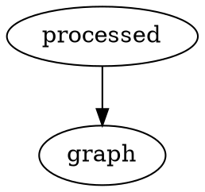
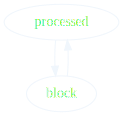

# mdBook Graphviz

[](https://crates.io/crates/mdbook-graphviz)
[](LICENSE)

## Install

```
cargo install mdbook-graphviz
```

Install [Graphviz](https://graphviz.gitlab.io/download/)

```
brew install graphviz
```

`book.toml`

```toml
[preprocessor.graphviz]
command = "mdbook-graphviz"
output-to-file = false # defaults to false, change to true to create SVG files instead of rendering them inline
```

## Usage

Just `dot` is supported, but any of the other graphviz tools would be easy to add.

### Mark A `dot` Code Block For Processing

#### Input

~~~markdown

~~~

#### Output

~~~markdown
<div class="mdbook-graphviz-output"><svg>...</svg></div>
~~~

The `class` attribute gives you the chance to apply a common style to all
the output images (e.g. [center all of them](https://github.com/dylanowen/mdbook-graphviz/issues/26)).

#### Rendered


### `dot` Code Blocks Without The `process` Flag Are Ignored

#### Input

~~~markdown

~~~

#### Output

~~~markdown

~~~

## Use mdBook theme colors

By default generated SVG colors are black edges and vertices on a white background.
If you want for a rendered graph instead to respect all mdBook themes,
you can specify `theme-colors.foreground` option to replace a specified string in CLI arguments and in the code with foreground color:

```toml
[preprocessor.graphviz]
theme-colors = { foreground = "foreground" }
arguments = [
  "-Tsvg_inline",
  "-Gbgcolor=transparent",
  "-Ecolor=foreground",
  "-Efontcolor=foreground",
  "-Ncolor=foreground",
  "-Nfontcolor=foreground",
]
```

### Rendered



Warning: this flag is not yet supported with `output-to-file` set.

## Output To File

The default is to embed the SVG as HTML in the Markdown, however if this causes problems or if the actual files are
needed you can disable this via the `output-to-file` flag:

```toml
[preprocessor.graphviz]
output-to-file = true
```

or

```shell
MDBOOK_preprocessor__graphviz__output_to_file="true" mdbook build
```

Warning: this flag is not yet supported with `respect-theme` set.

### .gitignore

This `.gitignore` should cover the generated SVG files.

```
*.generated.svg
```

## Link To Output File

When using `output-to-file`, links can be added to the images via the `link-to-file` flag:

```toml
[preprocessor.graphviz]
output-to-file = true
link-to-file = true
```

or

```shell
MDBOOK_preprocessor__graphviz__output_to_file="true" MDBOOK_preprocessor__graphviz__link_to_file="true" mdbook build
```

## Embedding dot files
Sometimes you don't want to write dot code, but instead include it from a file:

~~~markdown
```dot
{{#include path/to/file.dot}}
```
~~~

In this case, you might want to modify the order of preprocessors, so the
include directives get resolved before it's passed to Graphviz.

In that case, make sure your `[preprocessor.graphviz]` section in the config
orders itself after `links`:

```toml
[preprocessor.graphviz]
after = ["links"]
```

## Overriding the `info-string`

Some tools prefer a specific annotation for dot/graphviz diagrams.
For compatability with these tools `mdbook-graphviz` can support a custom value for marking diagrams it should process.
This is via the `info-string` flag:

```toml
[preprocessor.graphviz]
info-string = "graphviz"
```

or

```shell
MDBOOK_preprocessor__graphviz__info_string="graphviz" mdbook build
```

More information about preprocessors and ordering can be found
[here](https://rust-lang.github.io/mdBook/format/configuration/preprocessors.html?highlight=preprocessors#require-a-certain-order).
