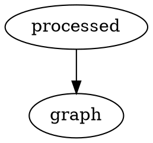

# mdBook Graphviz

[](https://crates.io/crates/mdbook-graphviz)
[](LICENSE)

## Install

```
cargo install mdbook-graphviz
```

Install [Graphviz](https://graphviz.gitlab.io/download/)

```
brew install graphviz
```

`book.toml`

```toml
[preprocessor.graphviz]
command = "mdbook-graphviz"
output-to-file = false # defaults to false, change to true to create SVG files instead of rendering them inline
```

## Usage

Just `dot` is supported, but any of the other graphviz tools would be easy to add.

### Mark A `dot` Code Block For Processing

#### Input

~~~markdown

~~~

#### Output

~~~markdown
<div><svg>...</svg></div>


~~~

#### Rendered


### `dot` Code Blocks Without The `process` Flag Are Ignored

#### Input

~~~markdown

~~~

#### Output

~~~markdown

~~~

## Output To File

The default is to embed the SVG as HTML in the Markdown, however if this causes problems or if the actual files are
needed you can disable this via the `output-to-file` flag:

```toml
[preprocessor.graphviz]
output-to-file = true
```

or

```shell
MDBOOK_preprocessor__graphviz__output_to_file="true" mdbook build
```

### .gitignore

This `.gitignore` should cover the generated SVG files.

```
*.generated.svg
```

## Embedding dot files
Sometimes you don't want to write dot code, but instead include it from a file:

~~~markdown
```dot
{{#include path/to/file.dot}}
```
~~~

In this case, you might want to modify the order of preprocessors, so the
include directives get resolved before it's passed to Graphviz.

In that case, make sure your `[preprocessor.graphviz]` section in the config
orders itself after `links`:

```toml
[preprocessor.graphviz]
after = ["links"]
```

More information about preprocessors and ordering can be found
[here](https://rust-lang.github.io/mdBook/format/configuration/preprocessors.html?highlight=preprocessors#require-a-certain-order).
