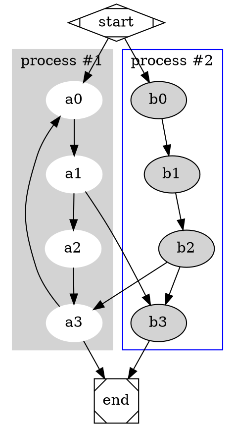

# Examples

## [Graphviz]()



## [D2 Layers](https://d2lang.com/tour/layers)

```d2
explain: |md
  This is the top layer, highest level of abstraction.
| {
  near: top-center
}

Tik Tok's User Data: {
  link: layers.tiktok
}

layers: {
  tiktok: {
    explain: |md
      One layer deeper:

      Tik Tok's CEO explained that user data is stored in two places currently.
    | {
      near: top-center
    }
    Virginia data center <-> Hong Kong data center
    Virginia data center.link: layers.virginia
    Hong Kong data center.link: layers.hongkong
    
    layers: {
      virginia: {
        direction: right
        explain: |md
          Getting deeper into details:

          TikTok's CEO explains that Virginia data center has strict security measures.
        | {
          near: top-center
        }
        Oracle Databases: {
          shape: cylinder
          style.multiple: true
        }
        US residents -> Oracle Databases: access
        US residents: {
          shape: person
        }
        Third party auditors -> Oracle Databases: verify
      }
      hongkong: {
        direction: right
        explain: |md
          TikTok's CEO says data is actively being deleted and should be done by the end of the year.
        | {
          near: top-center
        }
        Legacy Databases: {
          shape: cylinder
          style.multiple: true
        }
      }
    }
  }
}
```

## [D2 Scenarios](https://d2lang.com/tour/scenarios)

```d2
direction: right

title: {
  label: Normal deployment
  near: bottom-center
  shape: text
  style.font-size: 40
  style.underline: true
}

local: {
  code: {
    icon: https://icons.terrastruct.com/dev/go.svg
  }
}
local.code -> github.dev: commit

github: {
  icon: https://icons.terrastruct.com/dev/github.svg
  dev
  master: {
    workflows
  }

  dev -> master.workflows: merge trigger
}

github.master.workflows -> aws.builders: upload and run

aws: {
  builders -> s3: upload binaries
  ec2 <- s3: pull binaries

  builders: {
    icon: https://icons.terrastruct.com/aws/Developer%20Tools/AWS-CodeBuild_light-bg.svg
  }
  s3: {
    icon: https://icons.terrastruct.com/aws/Storage/Amazon-S3-Glacier_light-bg.svg
  }
  ec2: {
    icon: https://icons.terrastruct.com/aws/_Group%20Icons/EC2-instance-container_light-bg.svg
  }
}

local.code -> aws.ec2: {
  style.opacity: 0.0
}

scenarios: {
  hotfix: {
    title.label: Hotfix deployment
    (local.code -> github.dev)[0].style: {
      stroke: "#ca052b"
      opacity: 0.1
    }

    github: {
      dev: {
        style.opacity: 0.1
      }
      master: {
        workflows: {
          style.opacity: 0.1
        }
        style.opacity: 0.1
      }

      (dev -> master.workflows)[0].style.opacity: 0.1
      style.opacity: 0.1
      style.fill: "#ca052b"
    }

    (github.master.workflows -> aws.builders)[0].style.opacity: 0.1

    (local.code -> aws.ec2)[0]: {
      style.opacity: 1
      style.stroke-dash: 5
      style.stroke: "#167c3c"
    }
  }
}
```

## [D2 Steps](https://d2lang.com/tour/steps)

```d2
Chicken's plan: {
  style.font-size: 35
  near: top-center
  shape: text
}

steps: {
  1: {
    Approach road
  }
  2: {
    Approach road -> Cross road
  }
  3: {
    Cross road -> Make you wonder why
  }
}
```
